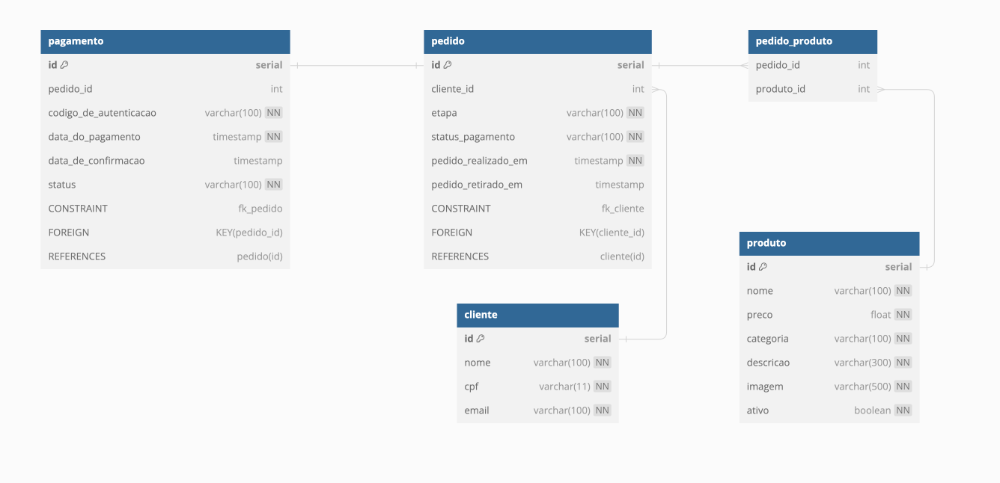

## PosTech Software Architecture

Projeto do tech challenge para avaliação do módulo 3 do curso Software Architecture.

### Api backend

Api backend contendo os endpoints que representam todo o processo. A api foi criada utilizando a linguagem Java junto com o Framework Spring boot, Domain Driven Design e Clean Architecture.
A api backend esta organizada em modulos representando as respectivas camadas do modelo do Clean Architecture:
- framework-drivers -> Framework & Drivers;
- interface-adapters -> Interface Adapters
- application-business -> Applications Business Rules
- enterprise-business -> Enterprise Business Rules

Devido a separação das camadas do Clean Architecture em módulos do maven foi necessário criar uma interface chamada ****InputPort*** responsável por acessar os componetes de ***UseCase***. 
As interfaces de ****InputPort*** foram necessárias e funcionam como um meio para acessar os componentes ***Gateway***, atráves de interfaces, pelos componentes ***UseCases*** pois o módulo application-business
não possui acesso ao módulo interface-adapters onde as interfaces de ***Gateway*** foram criadas.

## Kubernetes

No diretório ***kubernetes*** encontram-se todos os arquivos necessários para iniciar a api backend junto com o banco de dados postgres.
Os arquivos devem ser executados na seguinte ordem:

1. secrets
2. postgres
3. api

Junto dos arquivos de configuração foi disponibilizado também o arquivo ***k8s-config.sh*** que auxilia a implantação/exclusão do objetos kubernetes.
Para deploy dos arquivos executar o comando a partir da raiz do projeto:
`sh kubernetes/k8s-config.sh apply` e para remover o arquivos de configuração executar: `sh kubernetes/k8s-config.sh delete`

## SGBD e Modelo de entidade e relacionamento

A ferramenta SGBD escolhida para armazenar os dados da aplicação foi o Postgres. As motivações que levaram a escolha
dessa tecnologia foram:
- Ser um banco de dados relacional, o que possíbilita criar estruturas que reforcem a consistência dos dados que serão inseridos pela aplicação;
- Fácil utilização e configuração; 
- Possuir compatibilidade com o serviço RDS da AWS.

## Acesso a documentação da api (Swagger)

Após a configuração dos arquivos do kubernetes, podemos acessar a documentação da api a partir do endereço ***[http://localhost:8080/swagger-ui/index.html](http://localhost:8080/swagger-ui/index.html)***

### Etapas para realizar pedido (Totem de auto atendimento)

O processo para realizar um pedido através dos endpoints da api deve seguir os seguintes passos:

1. Verificar se o cliente possui cadastro ou cadastra-lo caso não seja cadastrado no sistema ainda:
   1. Para verificar se o cliente possui cadastro podemos utilizar o endpoint: ***[atendimento/cliente/buscar](http://localhost:8080/swagger-ui/index.html#/Totem%20de%20auto%20atendimento/buscarClientePorCpf)***
   2. Cadastrar o novo cliente no endpoint: ***[atendimento/cliente/cadastrar](http://localhost:8080/swagger-ui/index.html#/Totem%20de%20auto%20atendimento/cadastrarNovoCliente)***
2. A segunda etapa consiste em apresentar os produtos disponíveis para compor o pedido. Os pedidos podem ser acessados em: ***[atendimento/produtos](http://localhost:8080/swagger-ui/index.html#/Totem%20de%20auto%20atendimento/buscarProdutosPorCategoria)***
3. Após os produtos escolhidos o checkout do pedido pode ser concluido pelo endpoint ***[atendimento/pedido/checkout](http://localhost:8080/swagger-ui/index.html#/Totem%20de%20auto%20atendimento/checkout)***. O cliente é opcional durante o checkout, se o cliente desejar se identificar é necessário incluir o cpf do cliente no payload do pedido.
4. Com o checkout realizado o pedido só fica disponível para preparo após o pagamento do pedido.

### Etapas para realizar o pagamento do pedido

1. O pagamento pode ser realizado pelo endpoint: ***[pagamento](http://localhost:8080/swagger-ui/index.html#/Pagamentos/pagamento)*** informando o número retornado ao concluir o pedido
2. Após realizar o pagamento é necessário ainda a confirmação pela instituição financeira. Essa etapa pode ser realizada pelo 
endpoint ***[pagamento/webhook](http://localhost:8080/swagger-ui/index.html#/Pagamentos/confirmacaoPagamento)*** 
também informando o número do pedido e as opções de status CONFIRMADO ou RECUSADO.
3. O status do pagamento pode ser consultado em: ***[pagamento/{numero-do-pedido}](http://localhost:8080/swagger-ui/index.html#/Pagamentos/consultarStatusDoPagamento)***

### Atualizar as etapas do pedido e acompanhamento das etapas pelo cliente e atendimento

Após o pedido ser realizado e pago pelo cliente a cozinha pode iniciar o preparo.

1. O acompanhamento do status do pedido pode ser feito por dois endpoins:
   1. Pelo número do pedido ***[pedido/buscar-por-numero](http://localhost:8080/swagger-ui/index.html#/Pedidos/buscarPedidoPorId)***. Pode ser utilizado pelo atendente para para verificar pedidos em qualquer etapa e que foram ou não pagos e também os pedidos finalizados.
   2. Todos os pedidos pagos e aguardando a conclusão do preparo ficam disponíveis no endpoint: ***[pedido](http://localhost:8080/swagger-ui/index.html#/Pedidos/listar_1)***. Nesse endpoint só serão listados os pedidos com status de pagamento igual a Pago para que o cliente possa acompanhar em qual etapa o seu pedido se encontra.
   Os pedidos serão apresentados ordenados por data de recebimento e seguindo a prioridade: Pronto > Em preparação > Recebidos. 
   Os pedidos finalizados não são apresentados nessa consulta. Eles devem ser consultados na busca por numero do pedido: ***[pedido/buscar-por-numero](http://localhost:8080/swagger-ui/index.html#/Pedidos/buscarPedidoPorId)***
2. A equipe responsável pelo preparo dos pedidos pode atualizar as etapas a partir do endpoint: ***[pedido/proxima-etapa/{pedido}](http://localhost:8080/swagger-ui/index.html#/Pedidos/atualizaParaEmPreparacao)***

### Áreas administrativas

Para cadastrar novos produtos ou clientes podemos utilizar os seguintes endpoints:

1. Para produtos: ***[produtos](http://localhost:8080/swagger-ui/index.html#/%C3%81rea%20administrativa%20-%20Produtos)***
2. Para clientes: ***[clientes](http://localhost:8080/swagger-ui/index.html#/%C3%81rea%20administrativa%20-%20Clientes)***
